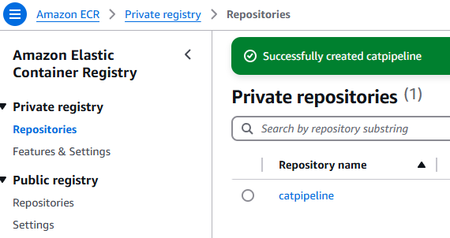
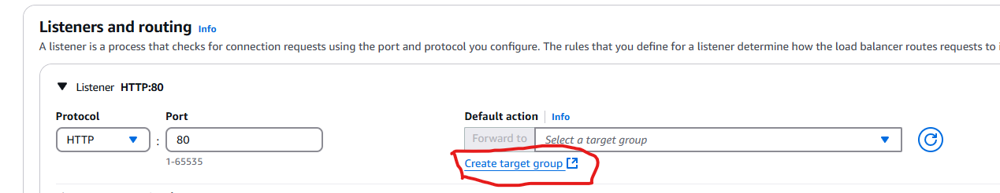

# AWS CI/CD Pipeline

- An exercise in creating an automated CI/CD pipeline for a Containerized (Docker) application using AWS Tooling

## Architecture of Pipeline

- GitHub Repo where the app is stored
- CodePipeline
  - Source Stage: Connected to GitHub/source control via a GitHub app (bot that acts on your behalf with temporary credentials)
  - Build stage: CodeBuild to produce deploy artifacts (container) and push to ECR (via a `buildspec.yml` configuration)
  - Deploy Stage: uses CodeDeploy which deploys 2 containers to ECS via a service definition created

## Pipeline Setup

### Create an ECR Repository to Store Container Images

- AWS Console > ECR > Private > Repositories > Create Repository
- Enter a name (must be unique within the repository), i.e. `appnamepipeline` and click Create

### Create CodeBuild Project to Build a Docker Image from files in your App Repo

- [Video Demo](https://learn.cantrill.io/courses/1101194/lectures/40856334)
  Build configuration is in a file `buildspec.yml`
- AWS Console > CodeBuild > Build projects > Create Project
- Name the project: `myappname-build`
- Manage Credentials if there are no creds for the source
  - For GitHub, Installing the GitHub App (AWS Connector for GitHub) is generally the recommended option
- Enter a branch name i.e. `main` for the Source version
  - **NOTE:** You can leave this blank if you don't want the build to start automatically on push (instead you would go into the project and click "Start Build")
- Environment section: Select an image to use (can use a custom image from your ECR)
- Specify a service role that the code build project will use to interact with Amazon Services (can optionally have it create one for you)
  - Environment > Additional Configuration > environment variables
  - These variables can be utilized in the `buildspec.yml` configuration file
    ```
    AWS_DEFAULT_REGION = your region (i.e. us-east-1)
    AWS_ACCOUNT_ID = copy and paste an account id that has admin priviledges
    IMAGE_TAG = latest
    IMAGE_REPO_NAME = name of the repo where built images go (use the ECR repo you created, i.e. `catpipeline` shown here:)
    ```
    
    <br>
    <br>
- Select buildspec file and point to your `buildspec.yml` file (CodeBuild by default will look for a file by this name in the root directory of your project repository)
  <br>
  
  <br>
  <br>
- **Artifacts** are output from CodeBuild which you can use as input to CodeDeploy to deploy your code to the infrastructure
- **Logs** can be specified and optionally use S3. Enter a group name and make the stream name the name of your pipeline (codebuild project name)
  <br>
  
  <br>
  <br>

### Update Permissions for CodeBuild Role

- Give the role used by CodeBuild to access services needed
- AWS Console > IAM > Roles > look for the role created in the build codebuild project process
- Click on the role > Add permissions > create inline policy
  - Add permissions to interact with ECR:
    ```json
    {
      "Statement": [
        {
          "Action": [
            "ecr:BatchCheckLayerAvailability",
            "ecr:CompleteLayerUpload",
            "ecr:GetAuthorizationToken",
            "ecr:InitiateLayerUpload",
            "ecr:PutImage",
            "ecr:UploadLayerPart"
          ],
          "Resource": "*",
          "Effect": "Allow"
        }
      ],
      "Version": "2012-10-17"
    }
    ```
  - Give the policy a name like `Codebuild-ECR` and create the policy

### Buildspec.YML - What CodeBuild does to files in your project repo

- Create a buildspec.yml file and add it to the root folder of your project
- After pushing to your repo main branch that should kick off a build (or you can go into the project and click "Start Build")
- This will build and create the image and store it in the ECR registry repo:
  <br>
  
  <br>
  <br>

### Testing out an image from your ECR

- Start an EC2 instance with Docker installed and ssh into it
- login to ECR: `aws ecr get-login-password --region <AWS_REGION> | docker login --username AWS --password-stdin ACCOUNT_ID_REPLACEME.dkr.ecr.<AWS_REGION>.amazonaws.com`
- get the URI of the image from your ECR repo:
  <br>
  
  <br>
  <br>
- on the Instance run `docker pull <imageuri_from_your_ecr>`
- `docker images` to get the id of the image you downloaded
- Then run it with `docker run -p 80:80 <image_id>` (adjust ports exposed if needed)
- Go to public IP to see it served

### CodePipeline

- AWS Console > CodePipeline > Create Pipeline
- Select "Custom Pipeline" then "Next"
- Name your pipeline, i.e. `appnamepipeline`
- Allow AWS to create a new service role for the pipeline to interact with AWS resources
- **Advanced Settings** - This is where you can specify where Artifacts are output to.
  - These can be used as input to any stage in a code pipeline and how you tie together stages
  - By default, a S3 bucket is created in the account to store artifacts, but you could also choose a custom location
- Click next and select a Source (i.e. GitHub via GitHub app or whatever source you set up)
- Add a Build Provider (i.e. CodeBuild if you're using that)
  <br>
  
  <br>
  <br>
- Creating the pipeline will run an initial run
- You can look for the artifact bucket (default) with a name like "codepipeline-region...":
  <br>
  
  <br>
  <br>

- When committing and pushing to your repo, a CloudWatch Event will be generated and the pipeline will run based on that event
- A docker image with the tag of latest and one with the commit hash id for history will be created (based on how the buildspec.yml is setup to tag images pushed)
- Artifacts specified in the `buildspec.yml` will be now available to be used in a deploy stage or other stage in the pipeline in the `BuildArtif/` folder:
  <br>
  
  <br>
  <br>

### Create a Load Balancer

- EC2 > Load Balancers > Create > Create Application Load Balancer
- Name the LB, i.e. `appnamepipeline`
- Select Internet facing using IPv4
- Select the Default VPC
- Select all the AZs for that VPC (tick the checkboxes)
- Security Groups: Create a new Security Group
  - name and desription: `appnamepipeline-SG`
  - Add Rule:
    <br>
    
    <br>
    <br>
- Select the created Security Group in the drop down (uncheck default etc)
- Create a Target Group which will point at Containers running in ECS Fargate:
  <br>
  
  <br>
  <br>
  - Name the target group and select IP Addresses since it will be pointing to containers on Fargate, HTTP and port 80 and the default VPC, then click Next, then leave defaults and Create Target Group
    <br>
    
    <br>
    <br>
- Close the create tab and then hit the refresh icon and select the Target Group created. This will ensure that anything hitting the load balancer on port 80 will be directed to this target group:
  <br>
  
  <br>
  <br>
- Create the load balancer

### Create an ECS Cluster

- AWS Console > ECS > Clusters in left side menu > Create Cluster
- Name the cluster and make sure AWS Fargate is selected under Infrastructure and click Create
- For using CodeDeploy, you first create a Task/Service definition on ECS cluster manually,
  - Then CodeDeploy will use the Service whenever a new image is made to deploy the image
  ```json
  {
    "taskDefinitionArn": "arn:aws:ecs:us-east-1:accountid:task-definition/taskname:1",
    "containerDefinitions": [
        {
            "name": "myapp",
            "image": "accountid.dkr.ecr.us-east-1.amazonaws.com/servicename:12345sha", // Code deploy will update the service with a new image
  ```

#### Create a Task Definition (defines a container)

- AWS Console > ECS > Task Definitions in left side menu
- click Create a New Task Definition
- Give the task a name
- Under `Container - 1` section, name the container and enter the URI (copy it from ECR > latest image > Copy URI):
  <br>
  
  <br>
  <br>
- Choose Operating System (i.e. Linux X86_64) , CPU, Memory
- Change the Task Role to the task execution role in the dropdown
- Click Create

#### Create a Service (how to deploy the container)

- Deploy Dropdown in Task created > Create Service:
  <br>
  
  <br>
  <br>
- Name the service, select your ECS cluster, select `Launch Type` and make sure Fargate is selected:
  <br>
  
  <br>
  <br>
- Input for Desired Tasks: `2` for high availability
  - **This makes 2 containers each in different AZs part of the target group that your load balancer is set to use**
- Deployment Options: `Rolling update`
- In Networking section, select the default VPC, all subnets, select your pipeline security group and leave the default security group selected as well, enable public IP:
  <br>
  
  <br>
  <br>
- Load Balancing Section:
  - Select use Load Balancer
  - Select Application Load Balancer
  - Select existing Load Balancer option: Choose the load balancer you created
  - Make sure you select your container to load balance
  - Under Listener, choose an existing listener and select the listener you created (i.e. `80:HTTP`)
  - Use an existing Target Group - select your TG created
- Optionally enable Autoscaling (need to setup alarms etc.)
- Click create
- This will start up two tasks as scene in the Tasks tab (two containers):
  <br>
  
  <br>
  <br>

#### Test the Task Deployments

- AWS Console > EC2 > Load Balancers in the left side menu
- Select your load balancer (click the name link)
- Find the DNS Name and copy that to get the link to visit in the browser (note: make sure to use HTTP and not https:// if you do not have ssl setup for the site)
  <br>
  
  <br>
  <br>

### Add CodeDeploy stage to Pipeline

- Go to AWS Console > CodePipeline > Edit to add a new stage for CodeDeploy
  <br>
  
  <br>
  <br>
- Click `+ Add Stage` button after the Build stage
- Name the new stage `Deploy`
- `+ Add Action group`
  - Name: `Deploy`
  - Action provider: choose `Amazon ECS` from the dropdown
  - Input Artifact: `BuildArtifact` (this is the imagedefinitions.json produced by the Build stage as an artifact which CodeDeploy will use now)
  - Choose the cluster and service you created
  - Image Definition File: enter the name of the artifact you created as part of the build stage: `imagedefinitions.json`
  - Click Done
  - Save > Save to complete adding the stage

### Pipeline logs

- To see logs of the pipeline progress go to Build logs (click on details links in the code pipeline stages):
  <br>
  
  <br>
  <br>

### Troubleshooting permissions errors

- See https://lancecleveland.com/2024/01/17/using-codepipeline-for-ecs-continuous-deployment/
- does not have sufficient permissions to access ECS actually means that it doesn’t have permission to delegate roles and policies to the newly created tasks.
- Each time a new container image is deployed, a new revision of the task definition is usually created. This new task definition needs to include the IAM role that the ECS task will use for permissions to access other AWS resources. The iam:PassRole permission is required for CodePipeline to assign this IAM role to the new task definition.

```json
{
  "Version": "2012-10-17",
  "Statement": [
    {
      "Effect": "Allow",
      "Action": [
        "ecs:RunTask", // run task permission needed on pipeline role
        "ecs:DescribeClusters",
        "ecs:DescribeTaskDefinitions",
        "ecs:ListTaskDefinitions",
        "ecs:RegisterTaskDefinition",
        "ecs:DeregisterTaskDefinition",
        "iam:PassRole" // pass role permission needed on pipeline role
      ],
      "Resource": "*"
    }
  ]
}
```

- NOTE: if you get permissions errors you may need to add ECS permissions to the service role in the Deploy stage of the pipeline (click the service role link in the pipeline settings tab)
- Go to Add Permissions > Attach Policies:
  <br>
  
  <br>
  <br>
- Select the CodeDeploy role for ECS:
  <br>
  
  <br>
  <br>
